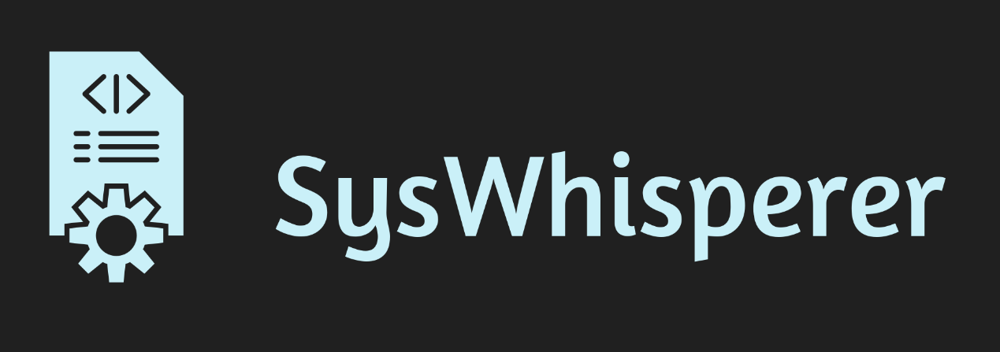

# SysWhisperer


[](https://www.gnu.org/licenses/gpl-3.0)

<div align="center">
    
    <h3>Утилита для анализа системной информации</h3>
</div>

## 🚀 Возможности

- 💻 Подробная информация о процессоре (ядра, частота, загрузка)
- 🧮 Мониторинг оперативной памяти
- 🎮 Поддержка видеокарт NVIDIA, AMD и Intel
- 📊 Экспорт данных в JSON
- 🔄 Кроссплатформенность (Windows и Linux)

## 📥 Установка

### Windows
1. Скачайте последнюю версию [syswhisperer.exe](https://github.com/anxnas/syswhisperer/releases/latest)
2. Запустите из командной строки:
```
syswhisperer.exe --version
```

### Linux
1. Скачайте последнюю версию
```
wget https://github.com/anxnas/syswhisperer/releases/latest/download/syswhisperer
```
2. Сделайте файл исполняемым и переместите в /usr/local/bin
```
chmod +x syswhisperer
sudo mv syswhisperer /usr/local/bin/syswhisperer
```

### Из исходного кода
1. Клонирование репозитория
```
git clone https://github.com/anxnas/syswhisperer.git
cd SysWhisperer
```
2. Установка зависимостей
```
pip install -r requirements.txt
```
3. Запуск
```
python main.py --version
```


## 🎯 Использование

### Базовое использование

```
syswhisperer
```

### Только информация о GPU

```
syswhisperer --no-cpu --no-memory
```

### Экспорт в JSON

```
syswhisperer --export system_info.json
```

### Пример вывода

```
Система: Windows 10

Видеокарта(ы):

GPU 1:
- Название: Radeon RX550/550 Series
- Видеопамять: 2048 МБ
- Версия драйвера: 31.0.21912.14
- Видеопроцессор: AMD Radeon Graphics Processor (0x699F)
- Тип видеопамяти: 2
- Текущее разрешение: 1680x1050

Процессор:
- Количество ядер: 12
- Текущая частота: 3400.00 МГц
- Загрузка CPU: 2.7%

Оперативная память:
- Всего: 7 ГБ
- Используется: 7 ГБ
- Загрузка памяти: 91.0%
```

## 🛠 Разработка

### Требования
- Python 3.8+
- pip


## 📄 Лицензия

Этот проект распространяется под лицензией GPL v3. Подробности в файле [LICENSE](LICENSE).

## 🤝 Вклад в проект

Мы приветствуем любой вклад в развитие проекта! Вот как вы можете помочь:

1. Форкните репозиторий
2. Создайте ветку для вашей функции (`git checkout -b feature/AmazingFeature`)
3. Зафиксируйте изменения (`git commit -m 'Add some AmazingFeature'`)
4. Отправьте изменения в ваш форк (`git push origin feature/AmazingFeature`)
5. Откройте Pull Request

## ⭐️ Звёзды репозитория

Если вам нравится проект, не забудьте поставить звезду! Это помогает другим разработчикам найти проект.

## 📞 Контакты

- Создатель: [anxnas](https://github.com/anxas)
- [Email](mailto:ananasicsoftwareinc@gmail.com)
- [Telegram канал](https://t.me/anxnas)

---
<div align="center">
    Made with ❤️ in Russia
</div>
